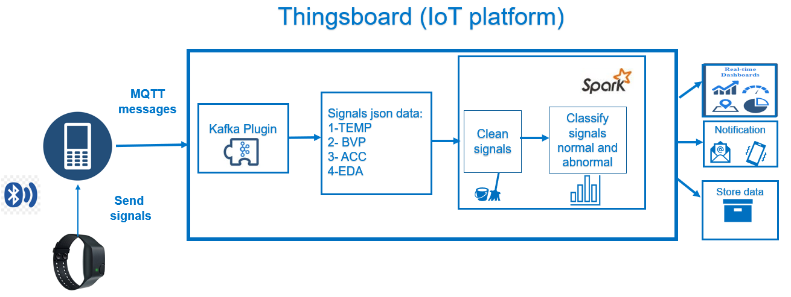

# 🩺 Abnormal Behavior Detection Using Kafka, Spark & Machine Learning

## 📘 Project Overview

This project introduces a **real-time abnormal behavior detection platform** developed using data streams from the **E4 wristband**, a wearable medical device. The platform captures streaming **physiological signals** via a mobile application and sends them to **Apache Kafka** topics in real-time.

Using **Apache Spark Streaming**, the data is consumed and analyzed using **machine learning classification models** to distinguish between normal and abnormal behavioral patterns. Upon detecting abnormalities, alerts are sent to designated recipients such as caregivers or medical professionals, enabling **timely medical intervention**.

---

## 🌟 Key Features

- 📡 Real-time ingestion of physiological signals from E4 wristband
- 🧠 Online prediction using Spark Streaming & ML classifiers
- 🚨 Instant alert notifications on abnormal behavior detection
- ⚙️ Scalable and fault-tolerant architecture with Kafka
- 📲 Integration with mobile apps and wearable IoT devices

---

## 🛠 Tools & Technologies

| Component            | Description                                                                 |
|----------------------|-----------------------------------------------------------------------------|
| **E4 Wristband**     | Wearable medical device that captures physiological signals                 |
| **Apache Kafka**     | Event streaming platform for real-time, high-throughput data ingestion      |
| **Apache Spark**     | Distributed processing engine with Spark Streaming & MLlib modules          |
| **Python**           | Used for both Kafka producer and Spark streaming consumer logic             |
| **ThingsBoard**      | IoT visualization and integration platform for alerting and monitoring      |

---

## 🧾 Prerequisites

- Java 8 or higher
- Python 3.6+
- Apache Kafka (v2.7+)
- Apache Spark (v2.4+ or v3.x)
- `pip install kafka-python`
- E4 Wristband device + Bluetooth-enabled mobile phone
- Spark dependencies for Kafka integration

---
# System Architecture

### ⚙️ How It Works
- Data Collection
The E4 wristband captures physiological signals like heart rate, temperature, EDA, etc., and sends them to a mobile app via Bluetooth.

- Streaming Ingestion
The mobile app sends the data to a Kafka topic (health-data) in real-time.

- Processing & Prediction
Spark Streaming consumes the Kafka topic, preprocesses the data, and applies classification algorithms to detect anomalies.

- Abnormality Detection
If an abnormal state is detected, the system raises an alert and notifies the concerned parties via ThingsBoard or alert modules.
---
## 🧰 Getting Started

### Clone the Repository

```bash
 git clone git@github.com:TaranaGit/Abnormal-behavior-detection-using-Kafka-Spark-ML.git
```
###  Start Kafka & ZooKeeper
```bash
# Start Zookeeper
bin/zookeeper-server-start.sh config/zookeeper.properties
```
### Start Kafka broker
```bash
bin/kafka-server-start.sh config/server.properties
```
### Create A Kafka Topic
```bash
bin/kafka-topics.sh --create \
  --topic health-data \
  --bootstrap-server localhost:9092 \
  --partitions 1 \
  --replication-factor 1
```
### 🧪 Machine Learning Models Used
✅ Decision Tree

✅ Random Forest (Best Performance)

✅ Logistic Regression